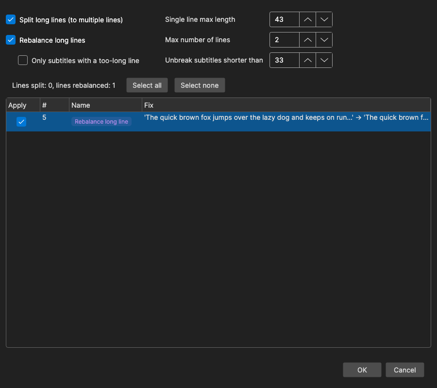

# Split / Rebalance Long Lines

Split or rebalance subtitle lines that exceed maximum character limits.

- **Menu:** Tools → Split/rebalance long lines...

<!-- Screenshot: Split break long lines window -->

## Options

- **Split long lines** — Split subtitles whose total length exceeds the maximum
- **Rebalance long lines** — Re-balance line breaks so lines have a more even length
- **Rebalance only lines that are too long** — Leave lines alone unless one of them exceeds the single-line maximum
- **Single line max length** — Maximum characters allowed on a single line
- **Max number of lines** — Maximum number of lines a subtitle may span (1-10)
- **Unbreak subtitles shorter than** — Subtitles with fewer characters than this are joined onto one line

The preview list updates live and shows all proposed fixes, each with an **Apply** checkbox. **Select all** / **Select none** tick or untick every row.
