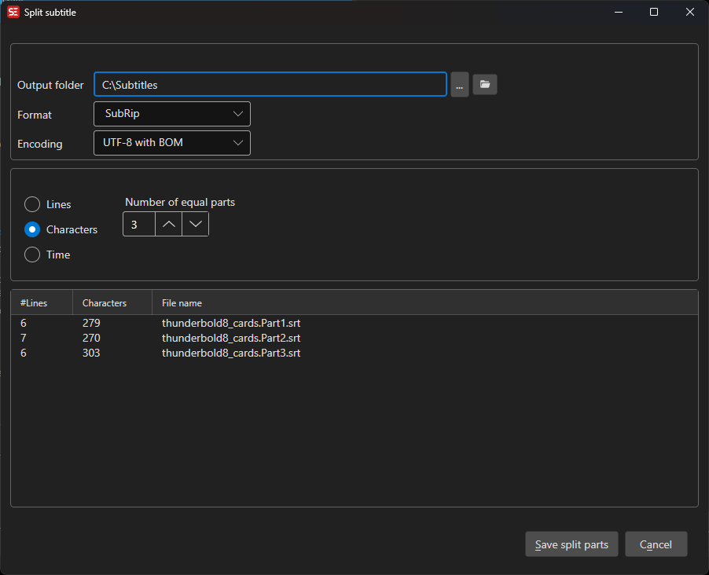

# Split Subtitle

Split a single subtitle file into two or more parts.

- **Menu:** Tools → Split subtitle...

<!-- Screenshot: Split subtitle window -->

## Split Options

- **Split at line number** — Split at a specific line
- **Split at time** — Split at a specific time code
- **Split by number of equal parts** — Divide into equal segments
- **Split by characters** — Split based on character count
