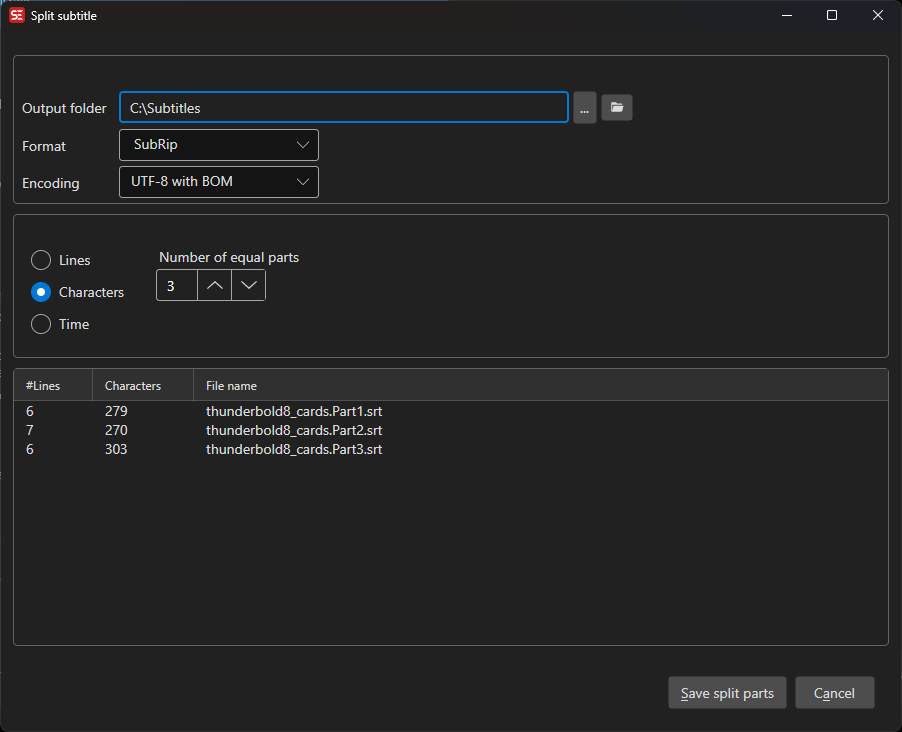

# Split Subtitle

Split a single subtitle file into two or more parts.

- **Menu:** Tools → Split subtitle...

<!-- Screenshot: Split subtitle window -->

## Split Options

Choose how to divide the subtitle into roughly equal parts:

- **Lines** — Split so each part has the same number of subtitle lines
- **Characters** — Split so each part has roughly the same number of characters
- **Time** — Split so each part covers roughly the same duration

Then set:

- **Number of equal parts** — How many output files to produce
- **Output folder** — Where to save the split files
- **Format** and **Encoding** — Subtitle format and text encoding used for the split files

Click **Save split parts** to write all parts to the output folder.
