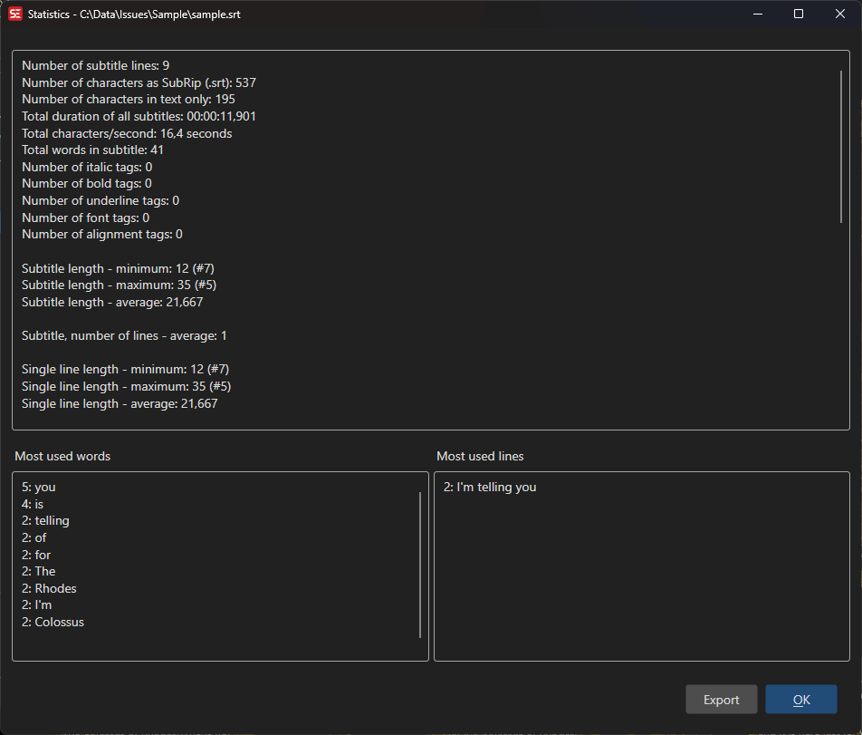

# Statistics

View detailed statistics about the currently loaded subtitle file, including line counts, word frequencies, and duration information.

**Menu:** `File` → `Statistics...`

## How to Use

1. Open a subtitle file.
2. Go to **File** → **Statistics...** to open the statistics dialog.
3. View general statistics, most used words, and most used lines.
4. Use **Save as...** to export the statistics to a text file.

## Features

### General Statistics
- Total number of lines.
- Total number of words and characters.
- Duration information (total duration, average duration per line).
- Subtitle format information.

### Most Used Words
- List of the most frequently used words in the subtitle.
- Word count for each word.

### Most Used Lines
- List of the most frequently repeated lines.
- Helps identify duplicate or repeated content.

### Export
- Save the full statistics report to a text file.

## Keyboard Shortcuts

| Shortcut | Action |
|----------|--------|
| F1 | Show help |
| Escape | Close dialog |
