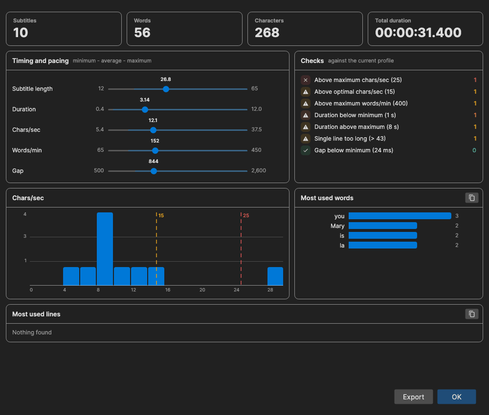

# Statistics

View detailed statistics about the currently loaded subtitle file, including line counts, word frequencies, and duration information.

**Menu:** `File` → `Statistics...`

## How to Use

1. Open a subtitle file.
2. Go to **File** → **Statistics...** to open the statistics dialog.
3. Read the dashboard: totals at the top, timing/pacing ranges and checks in the middle, and the word/line lists at the bottom.
4. Use **Export** to save the statistics to a text file.

## Features

### Totals
- Number of subtitles, words, and characters.
- Total duration.

### Timing and Pacing
- Minimum, average, and maximum for duration, characters per line, characters per second, words per minute, and gap between lines.

### Checks
- How many lines break the current profile's limits (line length, reading speed, duration, number of lines), so problems can be spotted before running the fix tools.

### Characters/sec Histogram
- A bar chart of how the reading speed is distributed across the subtitle.

### Most Used Words / Most Used Lines
- The most frequently used words and the most frequently repeated lines, with counts.
- Each list has a **Copy to clipboard** button.

### Export
- Save the full statistics report to a text file.

## Keyboard Shortcuts

| Shortcut | Action |
|----------|--------|
| F1 | Show help |
| Escape | Close dialog |
