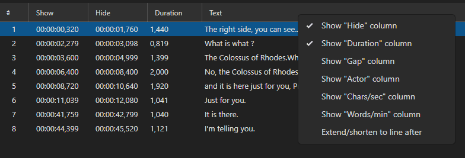

# Subtitle Grid

The subtitle grid is the main area for viewing and managing all subtitle lines.

<!-- Screenshot: Subtitle grid -->

## Columns

- **#** — Line number
- **Start time** — When the subtitle appears
- **End time** — When the subtitle disappears
- **Duration** — How long the subtitle is displayed
- **CPS** — Characters per second (reading speed indicator)
- **WPM** — Words per minute
- **Text** — The subtitle text
- **Original text** — The original text (in translation mode)

## Selecting Lines

- **Click** — Select a single line
- **Ctrl+Click** — Add/remove a line from selection
- **Shift+Click** — Select a range of lines
- **Ctrl+A** — Select all lines

## Context Menu

Right-click a line to access:
- Insert before / Insert after
- Delete selected lines
- Duplicate selected lines
- Split line
- Merge with previous / next
- Set alignment
- Toggle bookmark

## Keyboard Shortcuts (Grid)

| Shortcut | Action |
|----------|--------|
| `Delete` | Delete selected lines |
| `Ctrl+A` | Select all |
| `Ctrl+C` | Copy |
| `Ctrl+V` | Paste |
| `Ctrl+X` | Cut |
| `Enter` | Go to next line |
| `Up/Down` | Navigate lines |

## Bookmarks

You can bookmark subtitle lines for quick reference:
- **Add/Edit bookmark** — Adds a bookmark with optional text
- **Toggle bookmark** — Quickly toggle bookmark on/off
- **List bookmarks** — View all bookmarks
- **Go to next/previous bookmark** — Navigate between bookmarks
