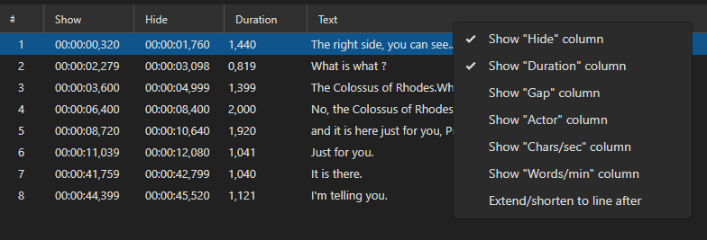
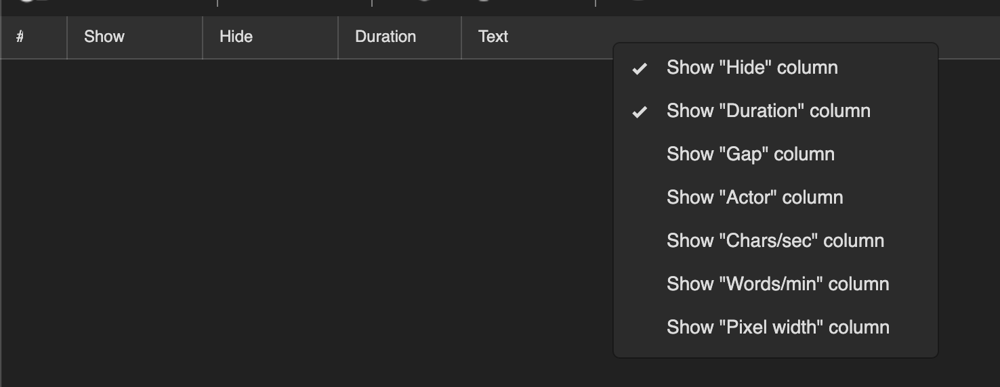

# Subtitle Grid

The subtitle grid is the main area for viewing and managing all subtitle lines.

<!-- Screenshot: Subtitle grid -->

## Columns

The grid has a fixed set of columns. Some are always visible; others can be toggled on or off via the column header context menu (see [Customizing Visible Columns](#customizing-visible-columns) below).

| Column | Always visible | Description |
|--------|---------------|-------------|
| **#** | ✓ | Line number (also shows a bookmark icon when the line is bookmarked) |
| **Show** | ✓ | Start time — when the subtitle appears |
| **Hide** | | End time — when the subtitle disappears |
| **Duration** | | How long the subtitle is displayed |
| **Text** | ✓ | The subtitle text |
| **Original text** | | The original text (visible in translation mode) |
| **Style** | | Style name (only available for formats that support styles, e.g. ASS/SSA) |
| **Gap** | | Time gap to the next subtitle line |
| **Actor** | | Actor/speaker name |
| **CPS** | | Characters per second (reading speed indicator) |
| **WPM** | | Words per minute |
| **Pixel width** | | Rendered pixel width of the text |
| **Layer** | | Layer number (only available for formats that support layers, e.g. ASS/SSA) |

## Customizing Visible Columns

Right-click anywhere in the **column header row** to open the column visibility menu. Each toggleable column is listed with a checkmark (✓) next to it when it is currently visible. Click a column name to toggle it on or off.

> **Note:** The **Style** and **Layer** columns only appear in the menu when the loaded subtitle format supports them (e.g. ASS/SSA).

<!-- Screenshot: Subtitle grid column header right-click menu showing column toggle options -->

## Selecting Lines

- **Click** — Select a single line
- **Ctrl+Click** — Add/remove a line from selection
- **Shift+Click** — Select a range of lines
- **Ctrl+A** — Select all lines

## Context Menu

Right-click a line to access:
- Insert before / Insert after
- Delete selected lines
- Duplicate selected lines
- Split line
- Merge with previous / next
- Set alignment
- Toggle bookmark

## Keyboard Shortcuts (Grid)

| Shortcut | Action |
|----------|--------|
| `Delete` | Delete selected lines |
| `Ctrl+A` | Select all |
| `Ctrl+C` | Copy |
| `Ctrl+V` | Paste |
| `Ctrl+X` | Cut |
| `Enter` | Go to next line |
| `Up/Down` | Navigate lines |

## Bookmarks

You can bookmark subtitle lines for quick reference:
- **Add/Edit bookmark** — Adds a bookmark with optional text
- **Toggle bookmark** — Quickly toggle bookmark on/off
- **List bookmarks** — View all bookmarks
- **Go to next/previous bookmark** — Navigate between bookmarks
