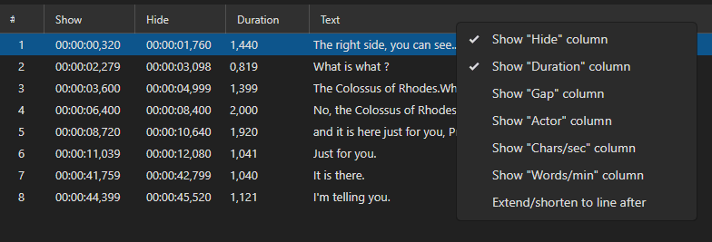
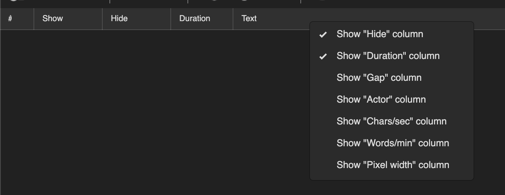

# Subtitle Grid

The subtitle grid is the main area for viewing and managing all subtitle lines.

<!-- Screenshot: Subtitle grid -->

## Columns

The grid has a fixed set of columns. Some are always visible; others can be toggled on or off via the column header context menu (see [Customizing Visible Columns](#customizing-visible-columns) below).

| Column | Always visible | Description |
|--------|---------------|-------------|
| **#** | ✓ | Line number (also shows a bookmark icon when the line is bookmarked) |
| **Show** | | Start time — when the subtitle appears |
| **Hide** | | End time — when the subtitle disappears |
| **Duration** | | How long the subtitle is displayed |
| **Text** | ✓ | The subtitle text |
| **Original text** | | The original text (visible in translation mode) |
| **Style** | | Style name (only available for formats that support styles, e.g. ASS/SSA) |
| **Gap** | | Time gap to the next subtitle line |
| **Actor** | | Actor/speaker name |
| **CPS** | | Characters per second (reading speed indicator) |
| **WPM** | | Words per minute |
| **Pixel width** | | Rendered pixel width of the text |
| **Forced** | | Check mark on lines marked as forced narrative (set with **Toggle forced** in the context menu) |
| **Layer** | | Layer number (only available for formats that support layers, e.g. ASS/SSA) |

## Customizing Visible Columns

Right-click anywhere in the **column header row** to open the column visibility menu. Each toggleable column is listed with a checkmark (✓) next to it when it is currently visible. Click a column name to toggle it on or off.

> **Note:** The **Style** and **Layer** columns only appear in the menu when the loaded subtitle format supports them (e.g. ASS/SSA).

**Columns...** at the bottom of the same menu opens a dialog where columns can be shown/hidden and reordered.

<!-- Screenshot: Subtitle grid column header right-click menu showing column toggle options -->

## Selecting Lines

- **Click** — Select a single line
- **Ctrl+Click** — Add/remove a line from selection
- **Shift+Click** — Select a range of lines
- **Ctrl+A** — Select all lines

## Context Menu

Right-click a line to access:
- Delete
- Insert before / Insert after
- Insert subtitle after current line... (insert a whole subtitle file)
- Column (delete text, insert text, paste from clipboard, shift cells up/down, text up/down)
- Split line / Assisted split... / Assisted move...
- Merge before / Merge after / Merge selected / Merge selected as dialog
- Extend to line before / Extend to line after
- Remove formatting (all, bold, italic, underline, color, font name, alignment)
- Italic / Bold / Color... / Font name... / Alignment...
- Bookmark...
- Toggle forced
- Selected lines... (Speech to text, Auto translate, Change casing, Set layer, Fix common errors, Save as..., etc.)
- Save forced lines as...

## Keyboard Shortcuts (Grid)

| Shortcut | Action |
|----------|--------|
| `Delete` | Delete selected lines |
| `Ctrl+A` | Select all |
| `Ctrl+C` | Copy |
| `Ctrl+V` | Paste |
| `Ctrl+X` | Cut |
| `Enter` | Go to subtitle and set video position (default; **Options → Settings** can change it to *Go to next line*) |
| `Up/Down` | Navigate lines |

### Pasting over several lines

With **one** line selected, `Ctrl+V` inserts the clipboard content below it. With **several** lines selected, the clipboard is pasted *over* the selection instead — handy for translating: copy the lines out, translate them elsewhere, select the same lines here and paste.

- Clipboard holds a subtitle (SRT, ASSA, …): the selected lines are replaced by the pasted ones, time codes included. The number of pasted lines does not have to match the selection.
- Clipboard holds plain text: one clipboard line goes into each selected line's text, and the time codes are left alone. Clipboard lines that go past the end of the selection are not pasted.

Both are a normal edit, so `Ctrl+Z` undoes them.

## Formatting Display

How the grid treats HTML/ASSA markup is a four-way choice — **Show formatted (HTML/ASSA) text in subtitle grid** in **Options → Settings → Appearance**:

| Mode | What the grid shows |
|------|---------------------|
| **Show formatting** | The tags are hidden and what they mean is rendered — italic, bold, color, font size. The default |
| **Show tags** | The text with its tags, with the tags colored so they are easy to pick out |
| **No formatting** | The raw text exactly as it is stored |
| **Hide tags** | The markup is stripped and only the dialogue is drawn, as plain themed text — no colors, fonts or sizes. Useful for translation, where the styling is only a distraction. Vector drawing tags are dropped too |

A shortcut can be assigned in **Options → Shortcuts** to cycle the four modes on the fly; the status bar names the mode you land on.

## Bookmarks

You can bookmark subtitle lines for quick reference:
- **Add/Edit bookmark** — Adds a bookmark with optional text
- **Toggle bookmark** — Quickly toggle bookmark on/off
- **List bookmarks** — View all bookmarks
- **Go to next/previous bookmark** — Navigate between bookmarks
