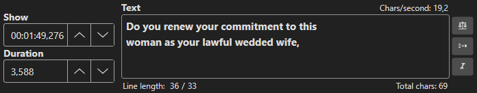

# Text Editor

The text editor allows you to edit the text content of the currently selected subtitle line.

<!-- Screenshot: Text editor area -->

## Editing Text

Type directly in the text editor to modify the subtitle text. Changes are reflected immediately in the subtitle grid.

## Formatting

| Shortcut | Action |
|----------|--------|
| `Ctrl+I` | Toggle italic |
| `Ctrl+B` | Toggle bold |

Additional formatting options:
- **Color** — Apply font color via shortcut or color picker
- **Remove formatting** — Strip all formatting tags
- **Alignment** — Set subtitle position (an1–an9)

## Line Breaking

- **Auto break** — Automatically break the line at an optimal position
- **Unbreak** — Remove line breaks and join into a single line

## Text Manipulation

| Shortcut | Action |
|----------|--------|
| `Ctrl+C` | Copy selected text |
| `Ctrl+X` | Cut selected text |
| `Ctrl+V` | Paste |
| `Ctrl+A` | Select all text |
| `Ctrl+Z` | Undo |

## Split Line

- **Split at cursor** — Split the subtitle at the text cursor position
- **Split at video position** — Split at the current video playback position
- **Split at video position and cursor** — Split using both video position and text cursor

## Word Movement

- **Fetch first word from next subtitle** — Move the first word of the next line to the current line
- **Move last word to next subtitle** — Move the last word to the next subtitle line
