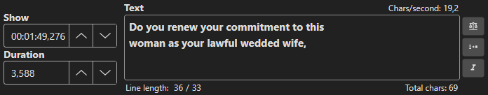

# Text Editor

The text editor allows you to edit the text content of the currently selected subtitle line.

<!-- Screenshot: Text editor area -->

## Editing Text

Type directly in the text editor to modify the subtitle text. Changes are reflected immediately in the subtitle grid.

## Formatting

| Shortcut | Action |
|----------|--------|
| `Ctrl+I` | Toggle italic |

Additional formatting options:
- **Bold / Underline** — No default key; assign one in **Options → Shortcuts**
- **Color** — Apply font color via shortcut or color picker
- **Remove formatting** — Strip all formatting tags
- **Alignment** — Set subtitle position (an1–an9)

## Line Breaking

- **Auto break** — Automatically break the line at an optimal position
- **Unbreak** — Remove line breaks and join into a single line

## Text Manipulation

| Shortcut | Action |
|----------|--------|
| `Ctrl+C` | Copy selected text |
| `Ctrl+X` | Cut selected text |
| `Ctrl+V` | Paste |
| `Ctrl+A` | Select all text |
| `Ctrl+Z` | Undo |

## Split Line

- **Split at cursor** — Split the subtitle at the text cursor position
- **Split at video position** — Split at the current video playback position
- **Split at video position and cursor** — Split using both video position and text cursor

## Word Movement

- **Fetch first word from next subtitle** — Move the first word of the next line to the current line
- **Move last word to next subtitle** — Move the last word to the next subtitle line

## AI Assistant

Ask a local AI model about the current line, or ask it for a change — available from the text box context menu (**AI assistant**) or the edit-box toolbar robot button.

- **Quick actions:** Fix errors, Fit reading speed, More formal, More casual — or type a free-form request
- The model sees the current line plus a few neighbouring lines as context
- The suggestion is shown next to the current text; press **Apply to line** to accept it
- An info button reveals the model's reasoning when the model produces any
- **Engines:** llama.cpp (managed local server with downloadable models, green dot = installed), Ollama, or any OpenAI-compatible endpoint — engine settings are edited directly in the window and are shared with [AI Review](ai-review.md)
