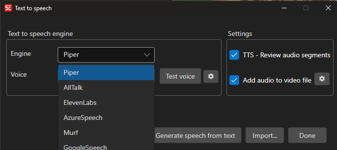

# Text to Speech

Generate speech audio from subtitle text using various TTS engines.

- **Menu:** Video → Text to speech...
- **Shortcut:** Configurable

<!-- Screenshot: Text to Speech window -->

## How to Use

1. Open **Video → Text to speech...**
2. Select a TTS engine from the dropdown
3. Select a language and voice
4. Optionally enable **Review audio clips** to review each generated clip
5. Optionally enable **Generate video file** to create a video with the audio
6. Click **Generate** to start

## Supported Engines

- **Piper** — Local, open-source TTS
- **AllTalk** — Local TTS server
- **ElevenLabs** — Cloud-based, high-quality voices (requires API key)
- **Azure Cognitive Services** — Microsoft cloud TTS (requires API key and region)
- **Google Cloud** — Google cloud TTS (requires key file)
- **Murf.ai** — Cloud TTS (requires API key)

## Engine Settings

Some engines require additional configuration:

- **API Key** — Enter your API key for cloud-based engines
- **Region** — Select the Azure region (for Azure engine)
- **Model** — Select the voice model
- **Key file** — Browse for Google Cloud service account key file

## Review Audio Clips

When enabled, each generated audio clip is played back for review before proceeding to the next subtitle line. This lets you verify quality and re-generate if needed.

## Keyboard Shortcuts

| Key | Action |
|-----|--------|
| Escape | Close / Cancel |
| F1 | Open help |
