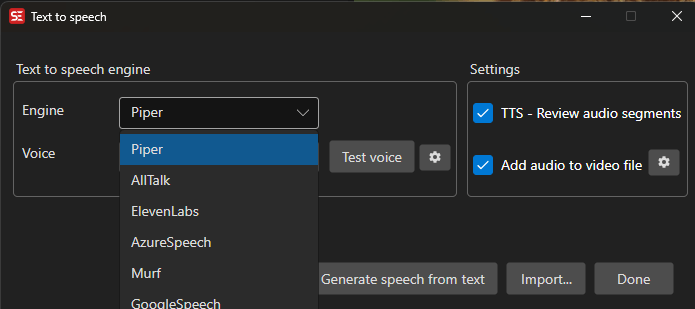

# Text to Speech

Generate speech audio from subtitle text using various TTS engines.

- **Menu:** Video → Text to speech...
- **Shortcut:** Configurable

<!-- Screenshot: Text to Speech window -->

## How to Use

1. Open **Video → Text to speech...**
2. Select a TTS engine from the dropdown
3. Select a language and voice
4. Optionally enable **Review audio clips** to review each generated clip
5. Optionally enable **Generate video file** to create a video with the audio
6. Click **Generate** to start

## Supported Engines

- **Piper** — Local, open-source TTS
- **Edge-TTS** — Microsoft Edge online voices
- **AllTalk** — Local TTS server
- **ElevenLabs** — Cloud-based, high-quality voices (requires API key)
- **Azure Cognitive Services** — Microsoft cloud TTS (requires API key and region)
- **Mistral TTS** — Cloud-based Mistral speech generation (requires API key)
- **Google Cloud** — Google cloud TTS (requires key file)
- **Qwen3 TTS** — Local downloadable Qwen3 TTS server and models
- **Kokoro TTS** — Local downloadable Kokoro TTS server and models
- **Murf.ai** — Cloud TTS (requires API key)

Local downloadable engines are installed into the Subtitle Edit data folder when you accept the download prompt.

## Engine Settings

Some engines require additional configuration:

- **API Key** — Enter your API key for cloud-based engines
- **Region** — Select the Azure region (for Azure engine)
- **Model** — Select the voice model
- **Key file** — Browse for Google Cloud service account key file

## Local SE5 Engines

### Qwen3 TTS

Qwen3 TTS runs a local server. Subtitle Edit can download the engine and the selected model on first use.

- Available model choices include **0.6B** and **1.7B Base**.
- The model download also requires the tokenizer model.
- Qwen3 TTS supports imported reference WAV voices. Imported voices appear in the voice dropdown.
- On Windows, Subtitle Edit can offer CPU or Vulkan builds depending on availability.

### Kokoro TTS

Kokoro TTS runs a local server with downloadable models.

- Subtitle Edit downloads the engine and model files when needed.
- Voice names are available immediately from the bundled voice list and can be refreshed from the running server.
- It is a good choice when you want a local, multilingual TTS engine without an API key.

### Mistral TTS

Mistral TTS is configured with an API key and model selection. The selected model is remembered in settings.

## Review Audio Clips

When **Review audio clips** is enabled, a dedicated review window opens after generation. This window lets you inspect, play, and regenerate audio for every subtitle line before the result is used.

### The Review Grid

Each subtitle line is shown as a row with the following columns:

| Column | Description |
|--------|-------------|
| **Include** | Checkbox to include or exclude the line from the final output |
| **#** | Subtitle line number |
| **Text** | The subtitle text (editable — double-click to modify before regenerating) |
| **Voice** | The voice used for that line |
| **Speed** | The speed factor applied to fit the audio into the subtitle's duration |
| **CPS** | Characters per second for the subtitle line |

### Playback Controls

- **Play** — Plays the selected line's audio clip
- **Stop** — Stops playback
- **Auto-continue** — When enabled, playback automatically advances to the next line as soon as the current clip finishes

### Regenerating a Clip

You can regenerate the audio for any individual line:

1. Select the line in the grid
2. Choose the desired engine, voice, language, model, or style from the dropdowns
3. Click **Regenerate** or press **Ctrl+R**

The new clip is trimmed for silence and automatically speed-adjusted to fit the subtitle timing. After regeneration the new clip plays back immediately for review.

For ElevenLabs, extra fine-tuning parameters are available when that engine is selected: **Stability**, **Similarity**, **Speaker Boost**, **Speed**, and **Style Exaggeration**. A **Reset** button restores all ElevenLabs parameters to their defaults.

### Regeneration History

Every time a clip is regenerated, the previous version is saved. To review the history for a line, click the **History** button on that row. The history dialog shows all generated versions with their voice name and speed, and lets you play each one. Selecting a version and clicking **OK** restores it as the active clip for that line.

### Including / Excluding Lines

Uncheck the **Include** checkbox on any row to exclude that line's audio from the final output. Excluded lines are skipped when the video file is assembled.

### Exporting Clips

Click **Export** to save all audio clips and a `SubtitleEditTts.json` metadata file to a folder of your choice. The JSON file records the audio file names, subtitle timings, voice names, engine names, speed factors, and text for each line, making it easy to re-import or post-process the clips externally.

### Keyboard Shortcuts

| Key | Action |
|-----|--------|
| Ctrl+R | Regenerate selected line |
| Escape | Close / Cancel |
| F1 | Open help |
