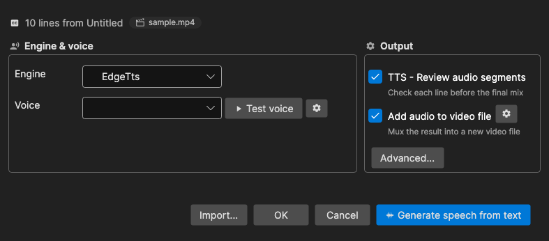

# Text to Speech

Generate speech audio from subtitle text using various TTS engines.

- **Menu:** Video → Text to speech...
- **Shortcut:** Configurable

<!-- Screenshot: Text to Speech window -->

## How to Use

1. Open **Video → Text to speech...**
2. Select a TTS engine from the dropdown
3. Select a language and voice
4. Optionally enable **Review audio clips** to review each generated clip
5. Optionally enable **Generate video file** to create a video with the audio
6. Click **Generate** to start
7. Close the window with **OK** to apply the session's subtitle changes (lines merged before generation, text edits made in the review window) to the subtitle in the main window — or **Cancel** to discard them

## Supported Engines

- **Piper** — Local, open-source TTS (Windows and Linux)
- **EdgeTts** — Microsoft Edge online voices
- **AllTalk** — Local TTS server
- **ElevenLabs** — Cloud-based, high-quality voices (requires API key)
- **AzureSpeech** — Microsoft cloud TTS (requires API key and region)
- **MistralSpeech** — Cloud-based Mistral speech generation (requires API key)
- **Murf** — Cloud TTS (requires API key)
- **GoogleSpeech** — Google cloud TTS (requires key file)
- **Kokoro TTS** — Local downloadable Kokoro TTS server and models
- **OmniVoice TTS** — Local CPU TTS with voice cloning and many languages
- **Qwen3 TTS (CrispASR)** — Local Qwen3 TTS running through the CrispASR runtime (VoiceDesign, CustomVoice, and Voice clone 1.7B models)
- **Chatterbox TTS (CrispASR)** — Chatterbox TTS via the CrispASR runtime, with voice cloning (multilingual Base or English-only Turbo model)
- **IndexTTS (CrispASR)** — IndexTTS-1.5 via the CrispASR runtime; the smallest voice-cloning engine here (about 870 MB)
- **CosyVoice3 (CrispASR)** — Alibaba CosyVoice3 with 9 languages and 18 Mandarin dialects, baked-in voice presets and zero-shot cloning
- **IndexTTS 2.5 (audio.cpp)** — IndexTTS-2.5 on the audio.cpp runtime: cloning in Chinese, English, Japanese, Spanish and Arabic, with emotion and speaking-rate control. The reference voice is sent per request, so switching voice does not restart the server
- **VoxCPM2 (CrispASR)** — Tokenizer-free diffusion engine at 48 kHz, about 30 languages, with zero-shot cloning
- **MOSS-TTS (CrispASR)** — MOSS-TTS v1.5 (Qwen3-8B backbone, 24 kHz) with zero-shot cloning
- **Zonos TTS (CrispASR)** — Zonos-v0.1 at 44.1 kHz with cloning from a reference recording
- **OmniVoice TTS (CrispASR)** — The OmniVoice model on the shared CrispASR runtime, run as a persistent server so the model loads once instead of once per line

Local downloadable engines are installed into the Subtitle Edit data folder when you accept the download prompt.

## Engine Settings

Some engines require additional configuration:

- **API Key** — Enter your API key for cloud-based engines
- **Region** — Select the Azure region (for Azure engine)
- **Model** — Select the voice model
- **Key file** — Browse for Google Cloud service account key file

## Voice Cloning

Several local engines can clone a voice from a reference recording. The first time you do this — when you import a reference recording, or generate speech with a cloned voice — Subtitle Edit shows a one-time dialog with the terms you are accepting. You have to tick the checkbox before you can continue.

The points that matter:

- Only clone a voice you have the right to use: your own, or one where the speaker has given permission. A voice is personal data and a personality right, so cloning without permission can be unlawful.
- If you publish audio that imitates a real person, you must say that it is AI-generated. In the EU this is required by the AI Act (Regulation (EU) 2024/1689, article 50), which applies from 2 August 2026.
- Subtitle Edit turns off the engine's spoken AI disclaimer, inaudible watermark and C2PA signature so the audio can be muxed into your video unchanged — so nothing marks the result as AI-generated for you.
- Do not use a cloned voice to impersonate someone, or for fraud, harassment or deception.
- The reference recording stays on your computer. Cloning runs locally and the audio is not uploaded anywhere.
- Each speech model also has its own license, which may add further limits on commercial use.

Declining just means "not now" — nothing is changed, the clone is refused, and you are asked again the next time. The answer is remembered per terms version, so you are asked again if the terms change.

### Cloning a Voice Heard in the Video

You do not have to prepare a reference recording by hand. In the main window, right-click a subtitle line in the waveform and choose **Clone voice to** → *engine name*. Subtitle Edit cuts the audio for that line out of the video's current audio track, asks what to call the new voice (pre-filled with the line's actor, or the video name and line number), and imports it as a cloned voice for the chosen engine. The line's own text is used as the transcript the cloning engines want, so you are not asked to type it.

The menu item appears when exactly one subtitle line is selected and the right-click was on that line, and a video is open. Only engines that can clone are listed. The new voice is then in the voice list for that engine the next time you open **Video → Text to speech...**.

Pick a line with clean speech: a couple of seconds or more, one speaker, and as little music and effects as possible. The clip is used exactly as it sounds in the video.

### Find Voices in Video and Clone

**Video → More → Find voices in video and clone...** does the whole cast in one go: it works out who speaks in the video, clones each of them, and leaves the cast assigned so the dubbing is ready to generate.

What happens, in order:

1. The video is transcribed with a speech-to-text engine that tells speakers apart — **Crisp ASR MOSS Diarize** is preselected (English and Chinese). You can change the engine in that window if you have another that labels speakers.
2. The speaker labels the engine writes into the text (`(Speaker 1) …`) are moved into the subtitle's **Actor** field, where they belong.
3. A dialog lists the speakers with their line count, how much audio each has, and one of their lines so you can tell who is who. Give each speaker a real name — **two speakers with the same name are merged into one voice**, which is how you fix a person diarization split in two. Pick the cloning engine here as well.
4. Each speaker's voice is cloned from up to ~15 seconds of their own lines (their longest ones, joined), with those lines as the transcript.
5. The subtitle switches to **ASSA**, which is the format that keeps actors, and the actor column is shown.
6. The actor→voice cast is remembered, so **Video → Text to speech...** opens with every speaker already assigned to their cloned voice. Press Generate.

If a subtitle is already open, its lines and text are kept — the speakers are matched to your existing lines by time overlap, so a translation is not replaced by the transcription. With nothing open, the transcription becomes the subtitle.

Lines that overlap no detected speech (music, on-screen text) are left without an actor and fall back to the globally selected voice.

### Clone From Video (Voice of Each Line)

For dubbing a video with several speakers there is a faster way than cloning each of them by hand. With a video open, pick **Clone from video (voice of each line)** at the top of the voice list. Every subtitle line is then spoken in the voice heard in the video at that line — whoever speaks line 12 in the original speaks line 12 in the dub. No reference recordings, no imports, no cast to assign.

Before generating, Subtitle Edit cuts one short reference clip per line out of the video's audio. Lines shorter than about three seconds are grown into the silence around them, but never into the neighbouring line — a reference with two speakers in it would clone the wrong person.

- **Supported engines:** OmniVoice TTS. The entry only appears for engines that accept a reference for each line; engines that load their reference when their server starts would have to reload the model for every line.
- **Reference text:** if you have the original subtitle loaded next to the translation, its lines are used as the transcript of the clips — that is what the video actually says, and it makes cloning noticeably better. Without an original loaded, the line's own text is used.
- **Test voice** previews the clone taken from the longest line of the subtitle.
- Quality depends on the source audio. Loud music or two people talking over each other in a line makes that line's clone worse. Longer subtitle lines clone better than very short ones, so a subtitle segmented into full sentences gives the best result.

## Local SE5 Engines

### Qwen3 TTS (CrispASR)

Qwen3 TTS runs through the CrispASR runtime and shares the `CrispASR/models` directory with the speech-to-text Crisp ASR engines.

- Available model choices are **1.7B VoiceDesign** (uses a free-text voice instruction), **1.7B CustomVoice** (nine built-in speakers selected by name), and **1.7B Voice clone** (clones an imported reference WAV).
- Subtitle Edit downloads the engine and the selected talker + codec/tokenizer GGUFs on first use.
- Imported reference WAV voices appear in the voice dropdown for the **Voice clone** model. Each imported voice needs a transcript of what is spoken in the WAV, and the reference audio is resampled to 24 kHz mono (required by the clone model).
- **Voice cloning can be slow**, especially the first time you synthesize after starting the engine — the model's compute kernels are compiled on first use, so the first clip can take a while (minutes on some machines); subsequent clips are much faster.

### Chatterbox TTS (CrispASR)

Chatterbox TTS runs through the CrispASR runtime (shared with the speech-to-text feature) and supports voice cloning.

- Available model choices are **Base** and **Turbo**.
- The **Base** model is multilingual: pick one of its 23 languages (Arabic, Chinese, Danish, Dutch, English, Finnish, French, German, Greek, Hebrew, Hindi, Italian, Japanese, Korean, Malay, Norwegian, Polish, Portuguese, Russian, Spanish, Swahili, Swedish, Turkish) in the language dropdown. **Auto** sends no language and lets the model guess — non-English text usually comes out with an English accent that way, so picking the language explicitly is recommended. **Turbo** is an English-only distillation and has no language choice.
- If the models were downloaded before the multilingual release, Subtitle Edit will prompt to download them again — the older files are English-only and ignore the language selection.
- Imported reference WAV voices are sent as the per-request voice for runtime cloning.

### Kokoro TTS

Kokoro TTS runs a local server with downloadable models.

- Subtitle Edit downloads the engine and model files when needed.
- Voice names are available immediately from the bundled voice list and can be refreshed from the running server.
- It is a good choice when you want a local, multilingual TTS engine without an API key.

### OmniVoice TTS

OmniVoice TTS runs the omnivoice-tts CLI on CPU. It supports a large set of languages and voice cloning from reference WAV files (with an accompanying transcript). Because each line is a separate run that takes its own reference, it is also the engine behind **Clone from video (voice of each line)**.

### MistralSpeech

MistralSpeech is configured with an API key and model selection. The selected model is remembered in settings.

## ElevenLabs Pauses and Pacing

You can control pausing and pacing in ElevenLabs output directly from the subtitle text.

- **Break tags** — Insert `<break time="1.5s" />` for an explicit pause (up to about 3 seconds). Keep them sparse: too many break tags in one line can make ElevenLabs speed up or add audio artifacts.
- **Punctuation** — Ellipses (`...`) add a hesitant pause, and dashes (`---`) add a short break. These are less precise than break tags but useful for a natural feel.

Subtitle Edit sends your text to ElevenLabs with **text normalization turned off**, so these pause cues are preserved instead of being collapsed or rewritten.

Behavior depends on the selected model:

- **Standard models** (`eleven_turbo_v2_5`, `eleven_multilingual_v2`, …) honor SSML `<break>` tags and punctuation pauses.
- **Eleven v3** does not support SSML `<break>` tags. Subtitle Edit automatically converts each `<break time="Xs" />` into the nearest v3 audio pause tag — `[short pause]` (under 0.75 s), `[pause]` (up to 1.5 s), or `[long pause]` (longer) — so the same subtitle text keeps working when you switch to v3.

## Review Audio Clips

When **Review audio clips** is enabled, a dedicated review window opens after generation. This window lets you inspect, play, and regenerate audio for every subtitle line before the result is used. A 120px waveform of the original video audio is shown above the grid as a reference. The session (clips, per-line voice and engine, includes, text edits) can be written to `SubtitleEditTts.json` and imported again later — see [Continuing a Session Later](#continuing-a-session-later). Regeneration history is kept for the current session only and is not part of the export.

### The Review Grid

Each subtitle line is shown as a row with the following columns:

| Column | Description |
|--------|-------------|
| **Include** | Checkbox to include or exclude the line from the final output |
| **#** | Subtitle line number |
| **Text** | The subtitle text (editable — double-click to modify before regenerating). Text edits are applied to the subtitle in the main window when the Text to speech window is closed with **OK** |
| **Voice** | The voice used for that line |
| **Speed** | The speed factor applied to fit the audio into the subtitle's duration |
| **CPS** | Characters per second for the subtitle line |

### Playback Controls

- **Play** — Plays the selected line's audio clip
- **Stop** — Stops playback
- **Auto-continue** — When enabled, playback automatically advances to the next line as soon as the current clip finishes

### Regenerating a Clip

You can regenerate the audio for any individual line:

1. Select the line in the grid
2. Choose the desired engine, voice, language, model, or style from the dropdowns
3. Click **Regenerate** or press **Ctrl+R**

The new clip is trimmed for silence and automatically speed-adjusted to fit the subtitle timing. After regeneration the new clip plays back immediately for review.

For ElevenLabs, extra fine-tuning parameters are available when that engine is selected: **Stability**, **Similarity**, **Speaker Boost**, **Speed**, and **Style Exaggeration**. A **Reset** button restores all ElevenLabs parameters to their defaults.

### Regeneration History

Every time a clip is regenerated, the previous version is saved. To review the history for a line, click the **History** button on that row. The history dialog shows all generated versions with their voice name and speed, and lets you play each one. Selecting a version and clicking **OK** restores it as the active clip for that line.

### Including / Excluding Lines

Uncheck the **Include** checkbox on any row to exclude that line's audio from the final output. Excluded lines are skipped when the video file is assembled.

### Exporting Clips

Click **Export** to save all audio clips and a `SubtitleEditTts.json` metadata file to a folder of your choice. The JSON file records the audio file names, subtitle timings, voice names, engine names, speed factors, and text for each line, making it easy to re-import or post-process the clips externally.

## Continuing a Session Later

A long video does not have to be dubbed in one sitting. Export the session when you stop, and import it when you come back:

1. In the review window, click **Export...** and pick a folder. Subtitle Edit writes `SubtitleEditTts.json` there, plus a `wav` subfolder with every generated clip.
2. Next time, open **Video → Text to speech...** and click **Import...**, then pick that `SubtitleEditTts.json`.
3. The review window opens again with all the lines and their audio, and you carry on where you left off.

What comes back with the session:

- Every line's generated clip, text and timing
- The engine, model, voice, instruction and speed factor each line was generated with
- The **Include** checkboxes
- The actor/voice **cast** mapping, so regenerating uses the same voices
- The video the session was made from — you do not have to open it first

From there you can play, edit text, regenerate single lines, and finish the session normally. Keep the `wav` folder next to the JSON file: the clip paths are stored relative to it, so the whole folder can be moved or copied to another machine.

### Keyboard Shortcuts

| Key | Action |
|-----|--------|
| Ctrl+R | Regenerate selected line |
| Escape | Close / Cancel |
| F1 | Open help |
