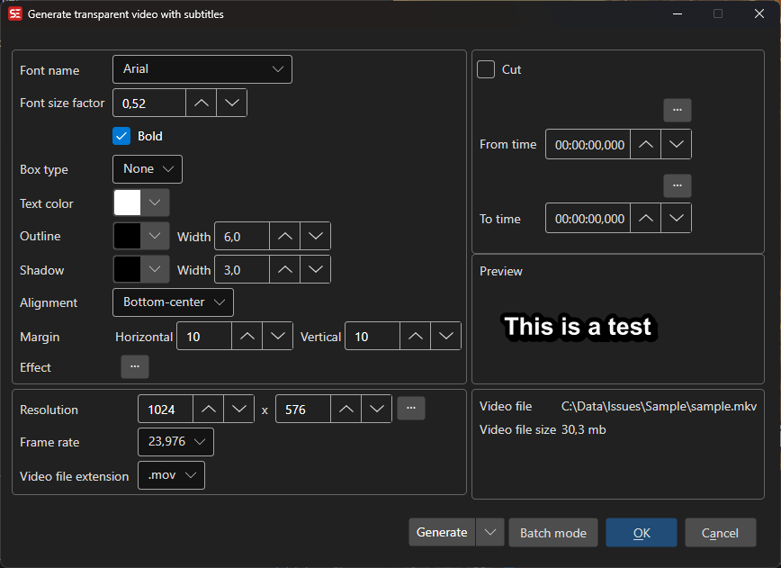

# Transparent Subtitles

Generate a transparent video overlay with rendered subtitles that can be composited over other video.

- **Menu:** Video → Generate transparent subtitles...
- **Shortcut:** Configurable

<!-- Screenshot: Transparent subtitles window -->

## How to Use

1. Open **Video → Generate transparent subtitles...**
2. Configure font settings (name, size, colors, outline, shadow, alignment)
3. Set the video resolution and frame rate
4. Select the output video extension (e.g. `.mov`, `.webm`)
5. Select an output folder
6. Click **Generate** to create the transparent video

## Font Settings

- **Font name** — Select the subtitle font
- **Font factor** — Scale the font size
- **Bold** — Use bold font weight
- **Outline** — Outline thickness and color
- **Shadow** — Shadow width and color
- **Box type** — Box style around text
- **Text color** — Subtitle text color
- **Alignment** — Subtitle alignment position
- **Margins** — Horizontal and vertical margins
- **Fix RTL** — Fix right-to-left text rendering

## Video Settings

- **Resolution** — Output video width and height (or use source resolution)
- **Frame rate** — Output frame rate
- **Extension** — Output container format (`.mov`, `.webm`)

## Cut Options

- **Cut from/to** — Generate only a portion of the subtitle timeline
- **Target file size** — Limit output to a specific file size

## Batch Mode

Multiple jobs can be queued for batch processing.

## Keyboard Shortcuts

| Key | Action |
|-----|--------|
| Escape | Close / Cancel |
| F1 | Open help |
