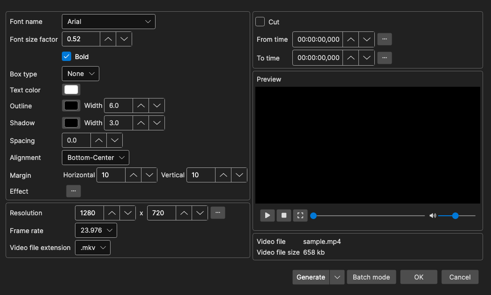

# Transparent Subtitles

Generate a transparent video overlay with rendered subtitles that can be composited over other video.

- **Menu:** Video → Generate transparent video with subtitles...
- **Shortcut:** Configurable

<!-- Screenshot: Transparent subtitles window -->

## How to Use

1. Open **Video → Generate transparent video with subtitles...**
2. Configure font settings (name, size, colors, outline, shadow, alignment)
3. Set the video resolution and frame rate
4. Select the output video extension (`.mov` or `.mkv`)
5. Select an output folder
6. Click **Generate** to create the transparent video

## Font Settings

- **Font name** — Select the subtitle font
- **Font factor** — Scale the font size
- **Bold** — Use bold font weight
- **Outline** — Outline thickness and color
- **Shadow** — Shadow width and color
- **Box type** — Box style around text
- **Text color** — Subtitle text color
- **Spacing** — Letter spacing, from -20 to 100
- **Alignment** — Subtitle alignment position
- **Margins** — Horizontal and vertical margins

## Effect

The **Effect** browse button opens a picker with one entry to apply to every line: **Fix right-to-left**, **Fade in/out**, **Slow font size change**, **Increase font kerning**, **Scroll up**, **Scroll down**, **Rotate in**, **Tilt bounce** and **Font size bounce in**. The selected effect is shown next to the button.

## Preview

In single mode the loaded video plays in an embedded player with the current style and effect rendered on top. In batch mode a static preview image rendered from the current settings is shown instead.

## Video Settings

- **Resolution** — Output video width and height (or use source resolution)
- **Frame rate** — Output frame rate
- **Extension** — Output container format (`.mov`, `.mkv`). The overlay is encoded as ProRes 4444, which `.mp4` and `.webm` cannot carry

## Cut Options

- **Cut from/to** — Generate only a portion of the subtitle timeline

## Batch Mode

Click **Batch mode** to queue several subtitle files (**Single mode** switches back). The list shows subtitle file name, size, video file and status, with **Add...**, **Remove**, **Clear** and **Pick video file...** buttons. **Output properties...** sets the output folder and naming; the chosen folder (or **Use source folder**) is shown next to it.

## Keyboard Shortcuts

| Key | Action |
|-----|--------|
| Escape | Close / Cancel |
| F1 | Open help |
