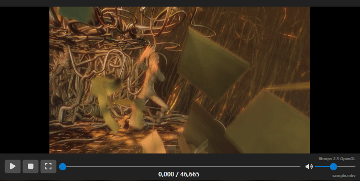
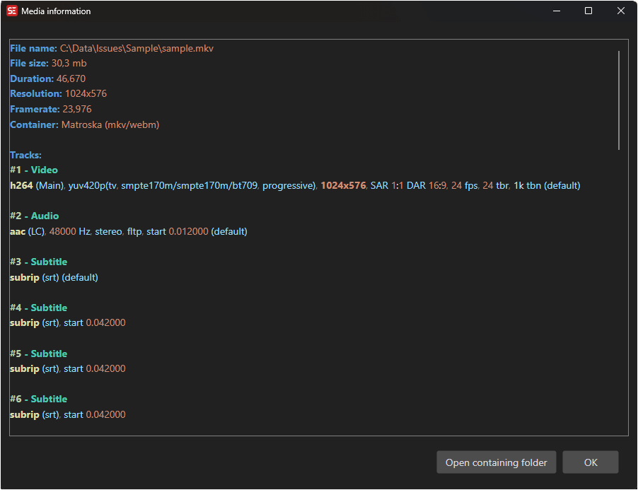

# Video Player

Subtitle Edit includes an integrated video player for previewing subtitles with video.

<!-- Screenshot: Video player -->

## Opening Video

- **Menu:** Video → Open video file...
- **Shortcut:** Configurable via Options → Shortcuts
- **Drag and drop** a video file onto the Subtitle Edit window
- You can also open video from a URL: **Video → Open video from URL...**

## Playback Controls

| Shortcut | Action |
|----------|--------|
| Play/Pause toggle | Toggle video playback |
| Play | Start playback |
| Pause | Pause playback |
| Play next | Play the next subtitle |
| Play selected lines | Play only the selected subtitle lines |

## Navigation

| Shortcut | Action |
|----------|--------|
| One frame back | Move one frame backward |
| One frame forward | Move one frame forward |
| 100ms back | Jump 100 milliseconds backward |
| 100ms forward | Jump 100 milliseconds forward |
| 500ms back | Jump 500 milliseconds backward |
| 500ms forward | Jump 500 milliseconds forward |
| 1 second back | Jump 1 second backward |
| 1 second forward | Jump 1 second forward |
| Custom back/forward | Configurable jump amounts |

> **Note:** Actual key bindings depend on your shortcut configuration. See **Options → Shortcuts**.

## Go to Video Position

Jump to a specific time code position in the video.

- **Menu:** Video → Go to video position...

## Playback Speed

- **Toggle playback speed** — Switch between normal and custom speed
- **Slower** — Decrease playback speed
- **Faster** — Increase playback speed

## Full Screen

- **Shortcut:** Configurable
- Toggle full-screen video playback

## Undock / Redock

You can undock the video player into a separate window for multi-monitor setups:
- **Undock video controls**
- **Redock video controls**

## Supported Video Players

Configure the video player backend in **Options → Settings → Video Player**:
- **libmpv** — Recommended for best format support
- **VLC** — Popular alternative
- **None** — Disable video playback

## Video Info

You can view detailed information about the video file by right-clicking on the video file name.

This displays:
- Video codec, resolution, frame rate, and bitrate
- Audio tracks with codec and channel information
- Subtitle tracks (if embedded)
- Duration and file size

<!-- Screenshot: Video info dialog -->

## Audio Tracks

If the video has multiple audio tracks, you can toggle between them via the video menu or a shortcut.
