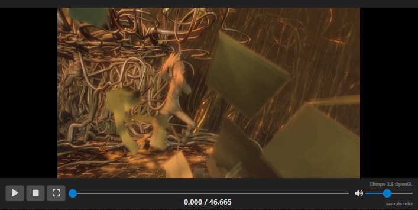
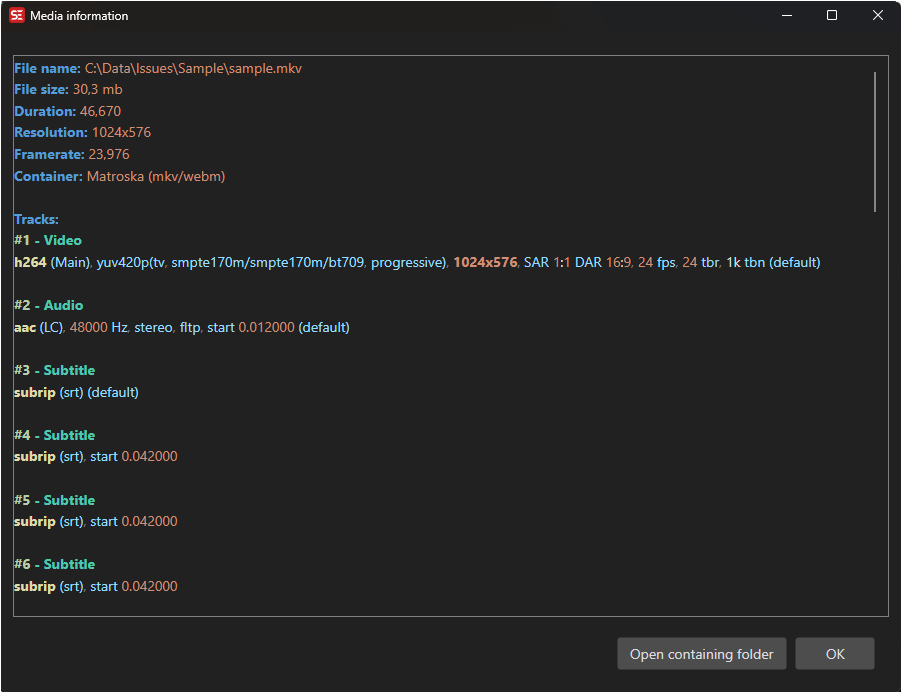

# Video Player

Subtitle Edit includes an integrated video player for previewing subtitles with video.

<!-- Screenshot: Video player -->

## Opening Video

- **Menu:** Video → Open video...
- **Shortcut:** Configurable via Options → Shortcuts
- **Drag and drop** a video file onto the Subtitle Edit window
- You can also open video from a URL: **Video → Open video from URL...**
- Recently opened videos are listed under **Video → Open recent video**; the submenu's **Clear recent videos** item empties the list

## Playback Controls

| Shortcut | Action |
|----------|--------|
| Play/Pause toggle | Toggle video playback |
| Play | Start playback |
| Pause | Pause playback |
| Play next (and stop / and loop) | Play the next subtitle, then stop or loop |
| Play previous (and stop / and loop) | Play the previous subtitle, then stop or loop |
| Play selected lines | Play only the selected subtitle lines |

> **Note:** When a "play and stop" playback stops, the video parks on the **last visible frame** of the line (one frame before its end time) rather than exactly on the end time. This keeps the line you just played visible on the video — stopping exactly on the end time would show a blank frame, or the next line when two lines share a boundary. The played line also stays selected in the subtitle grid.

## Navigation

| Shortcut | Action |
|----------|--------|
| One frame back | Move one frame backward |
| One frame forward | Move one frame forward |
| 100ms back | Jump 100 milliseconds backward |
| 100ms forward | Jump 100 milliseconds forward |
| 500ms back | Jump 500 milliseconds backward |
| 500ms forward | Jump 500 milliseconds forward |
| 1 second back | Jump 1 second backward |
| 1 second forward | Jump 1 second forward |
| Custom back/forward | Configurable jump amounts |

> **Note:** Actual key bindings depend on your shortcut configuration. See **Options → Shortcuts**.

## Go to Video Position

Jump to a specific time code position in the video.

- **Shortcut:** Configurable via **Options → Shortcuts** (search for "Go to video position")

## Playback Speed

- **Toggle playback speed** — Switch between normal and custom speed
- **Slower** — Decrease playback speed
- **Faster** — Increase playback speed

## Full Screen

- **Shortcut:** Configurable
- Toggle full-screen video playback

## Undock / Redock

You can undock the video player into a separate window for multi-monitor setups:
- **Undock video controls**
- **Redock video controls**

## Secondary Subtitles

You can open a secondary subtitle on the video player and remove it again from the Video menu. This is useful when checking a translation against the original subtitle while previewing video playback.

**Video → Open second subtitle file...** sits in the same spot as in Subtitle Edit 4, right after the open/close video items (it is shown while a video is loaded), and **Remove second subtitle file** appears below it while one is shown. Only one second subtitle is shown at a time: opening another file replaces the current one, and the file picker starts at the current second subtitle, so re-opening it is also the way to adjust its style without removing it first.

## Embedded Subtitles

Use [Embedded Subtitles](embedded-subtitles.md) to add, remove, preview, and edit Matroska/WebM embedded subtitle tracks.

## Supported Video Players

Configure the video player backend in **Options → Settings → Video player**:
- **libmpv - OpenGL** — default on Linux and macOS
- **libmpv - Native Window ID rendering** — default on Windows (not available on macOS)
- **libmpv - Software rendering (slow)**
- **libVLC - Native Window ID rendering** — alternative backend (Windows and Linux only)

The same settings page also has:
- **Show stop button** / **Show full-screen button**
- **Hide video controls in full-screen**
- **Auto-open video file when opening subtitle**
- **Download mpv** / **Download VLC** — fetch the player library when it is not installed
- **Subtitle preview properties** — how the subtitle is drawn on the video

## Video Info

You can view detailed information about the video file via the **Show media information** shortcut (assign a key in **Options → Shortcuts**).

This displays:
- Video codec, resolution, frame rate, and bitrate
- Audio tracks with codec and channel information
- Subtitle tracks (if embedded)
- Duration and file size

<!-- Screenshot: Video info dialog -->

## Audio Tracks

If the video has multiple audio tracks, you can toggle between them via the video menu or a shortcut.

## Video Menu Options

The Video menu also includes:

- **Toggle select subtitle while playing** - automatically select the current subtitle during playback.

Under **Video → More** (shown while a video is loaded):

- **Chapters...** - edit, import, export and write the video's chapter marks, see [Chapters](chapters.md).
- **Cut video...** - cut or merge segments of the video, see [Cut Video](cut-video.md).
- **Find voices in video and clone...** - find the speakers in the video, clone each voice and set up the cast for dubbing, see [Text to Speech](text-to-speech.md#find-voices-in-video-and-clone).
- **Re-encode video for better subtitling...** - see [Re-encode Video](re-encode-video.md).
- **Remux video...** - repackage the video with new audio tracks and soft subtitles, see [Remux Video](remux-video.md).
- **Set video offset...** - shift video playback relative to the subtitle timing. The dialog keeps a drop-down of recently used offsets next to the time code box (the last ten you applied; 1 hour and 10 hours are offered until you have applied your own) - picking one fills the box. While an offset is active the menu item reads **Update video offset from ...** instead.
- **SMPTE timing (non-integer frame rate)** - toggle SMPTE-style timing display when available.
- **Toggle waveform toolbar** - show or hide the toolbar above the waveform.
