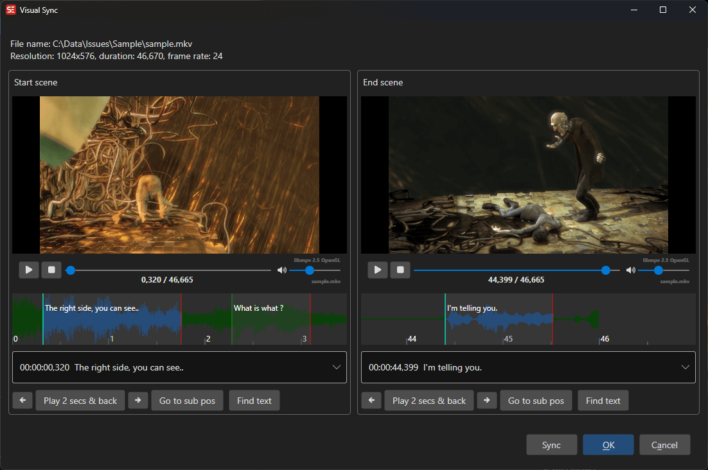

# Visual Sync

Synchronize subtitles visually by matching two points in the video.

- **Menu:** Sync → Visual sync...

<!-- Screenshot: Visual sync window -->

## How to Use

1. Open **Sync → Visual sync...**
2. Play the video to find where the first subtitle should appear
3. Set the first sync point
4. Play to where the last subtitle should appear
5. Set the second sync point
6. Click **OK** to apply the synchronization

The timing of all subtitles will be linearly adjusted to match the two sync points.
