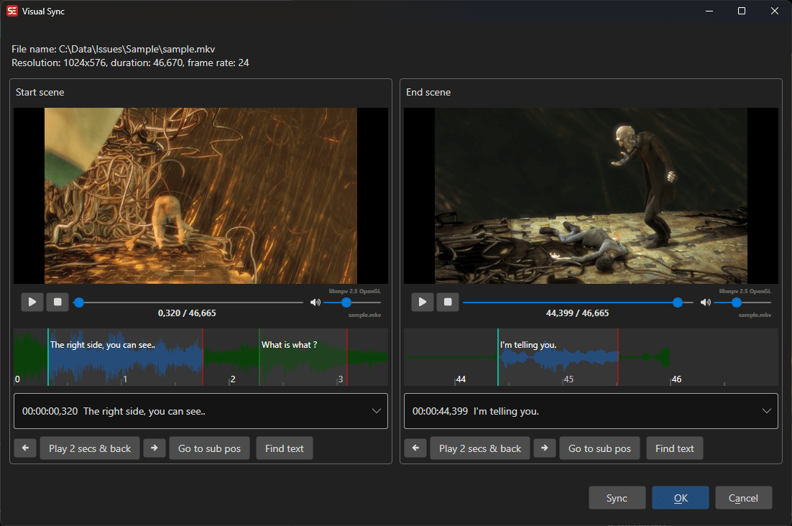

# Visual Sync

Synchronize subtitles visually by matching two points in the video.

- **Menu:** Synchronization → Visual sync...

<!-- Screenshot: Visual sync window -->

## How to Use

The Visual sync window shows two video player panes ("Start scene" and "End scene"), each with its own audio visualizer and a combo box for picking a subtitle line.

1. Open **Sync → Visual sync...**
2. In the **Start scene** pane, pick a subtitle line near the beginning and play the video to the position where that line should start
3. In the **End scene** pane, pick a subtitle line near the end and play the video to the position where that line should start
4. Click **Sync** to apply (or use **Manual sync...** from the Sync split-button for a manual offset/speed adjustment)
5. Click **OK** to keep the result

The timing of all subtitles is linearly adjusted to match the two sync points. The window remembers its size and position between sessions.
