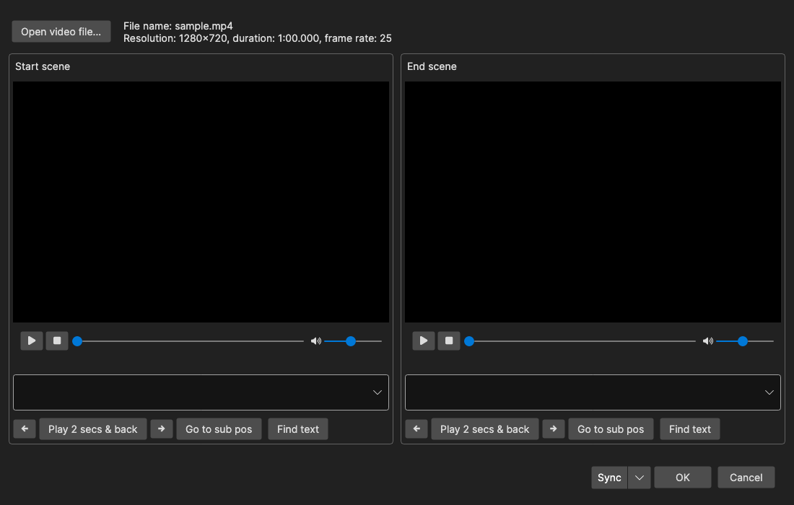

# Visual Sync

Synchronize subtitles visually by matching two points in the video.

- **Menu:** Synchronization → Visual sync...

<!-- Screenshot: Visual sync window -->

## How to Use

The Visual sync window shows two video player panes ("Start scene" and "End scene"), each with its own audio visualizer and a combo box for picking a subtitle line. The subtitle is drawn on both videos with the same look as on the main window's video, and both players use the audio track selected in the main window (**Video → Audio tracks** or the waveform toolbar picker); there is no separate track picker in the dialog.

The waveform under each video only appears when the main window has a waveform to share. Drag the handle between the video and the waveform to resize the waveform - both panes follow, and the height is remembered between sessions.

1. Open **Sync → Visual sync...**
2. In the **Start scene** pane, pick a subtitle line near the beginning and play the video to the position where that line should start
3. In the **End scene** pane, pick a subtitle line near the end and play the video to the position where that line should start
4. Click **Sync** to apply (or use **Manual sync...** from the Sync split-button for a manual offset/speed adjustment)
5. Click **OK** to keep the result

An **Open video file...** button at the top loads a video if none is open. Each pane has **One second back** / **One second forward** arrow buttons, **Play 2 secs & back**, **Go to sub pos** (jump to the selected line's position) and **Find text** to search for a line.

The timing of all subtitles is linearly adjusted to match the two sync points. The window remembers its size and position between sessions.
