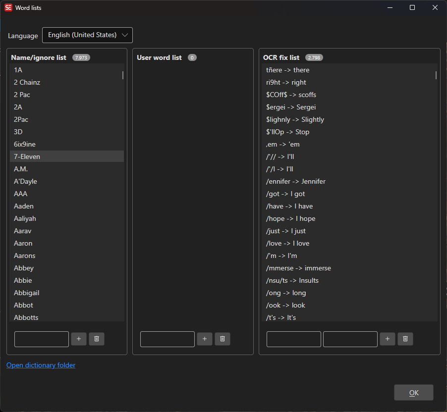

# Word Lists

Manage custom word lists used by spell check and OCR error fixing.

- **Menu:** Options → Word lists...
- **Shortcut:** Configurable

<!-- Screenshot: Word lists window -->

## How to Use

1. Open **Options → Word lists...**
2. Select a language from the dropdown
3. Manage entries in the three word list categories
4. Changes are saved automatically when entries are added or removed

## Word List Categories

### Names / Proper Nouns

A list of names and proper nouns that should not be flagged as misspelled. These are shared with the spell checker and OCR fix engine.

- Add a new name in the text field and click **Add**
- Select a name and click **Remove** to delete it

### User Words

Custom words added to the user dictionary. These supplement the main spell check dictionary.

- Add a new word in the text field and click **Add**
- Select a word and click **Remove** to delete it

### OCR Fix Replacements

Find-and-replace pairs used during OCR to fix common recognition errors (e.g., "rn" → "m", "0" → "O").

- Enter the **Find** and **Replace** text, then click **Add**
- Select a pair and click **Remove** to delete it

## Language Selection

Word lists are organized by language. The language dropdown shows all languages that have dictionary or word list files installed in the dictionaries folder.

## Keyboard Shortcuts

| Key | Action |
|-----|--------|
| Escape | Close |
| F1 | Open help |
