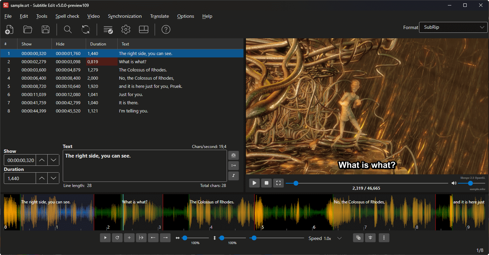
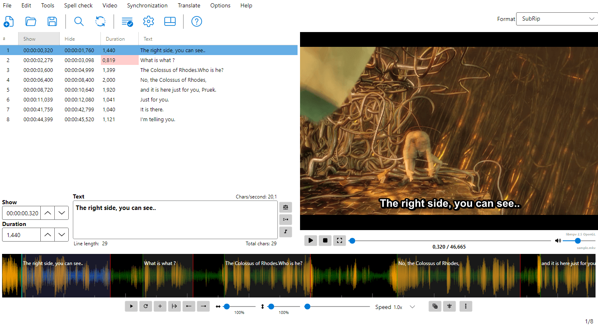

# Overview

## What is Subtitle Edit?

Subtitle Edit is a free, open-source editor for video subtitles. It allows you to create, edit, adjust, and convert subtitles in a wide variety of formats.

**Subtitle Edit 5** is the latest generation, built with [Avalonia UI](https://avaloniaui.net/) for cross-platform support (Windows, Linux, macOS).

> **Note:** Subtitle Edit 5 is currently in beta testing.

## Key Features

- **Create and edit** subtitles in 300+ formats
- **Synchronize** subtitles to video with visual tools
- **Speech to Text** — transcribe audio using Whisper engines
- **Text to Speech** — generate audio from subtitle text
- **Translate** subtitles automatically
- **OCR** — convert image-based subtitles (Blu-ray, DVD, etc.) to text
- **Fix common errors** automatically
- **Spell check** with dictionary support
- **Burn-in** subtitles into video
- **Batch convert** multiple files
- **ASSA/SSA styling** with advanced override tags, drawing, and positioning
- **Waveform/spectrogram** for precise timing
- **Shot change detection** for professional workflows
- **Export to image based subtitles** (Blu-ray SUP, BDN-xml, VobSub, etc.)

## System Requirements

- Windows 10+ / Linux / macOS 
- [FFmpeg](https://ffmpeg.org/) (for audio/video processing)
- [libmpv](https://mpv.io/) for video playback

## Getting Started

1. Download and install Subtitle Edit
2. Open a video file via **Video → Open video file...**
3. Open or create a subtitle file via **File → Open** or **File → New**
4. Edit subtitles in the text editor and subtitle grid
5. Use the waveform to visually adjust timing
6. Save your work via **File → Save**

<!-- Screenshot: Main window overview -->

## Main Window Layout

The main window consists of several key areas:

- **Menu Bar** — Access all features
- **Toolbar** — Quick access to common actions
- **Subtitle Grid** — List of all subtitle lines with timing and text
- **Text Editor** — Edit the currently selected subtitle text
- **Video Player** — Preview video with subtitles
- **Audio Visualizer** — Waveform/spectrogram for precise timing adjustments

Subtitle Edit offers **12 different layouts** for arranging these areas. You can choose and customize the layout via **Options → Choose layout**.

For a detailed guide to each area, mouse interactions, and keyboard shortcuts, see the **[Main Window](features/main-window.md)** documentation.

<!-- Screenshot: Main window with light mode -->

