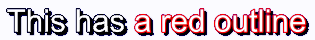
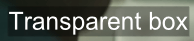
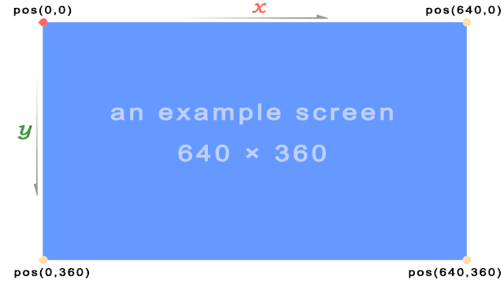
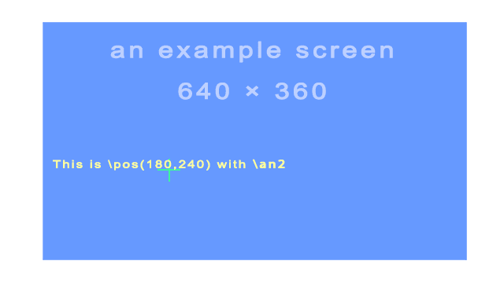
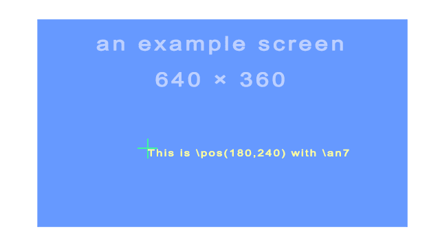
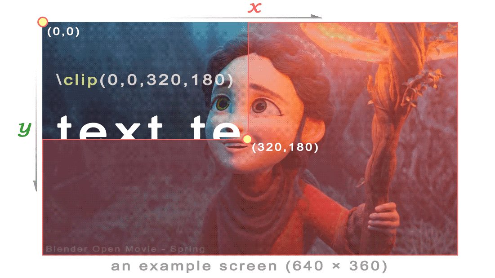
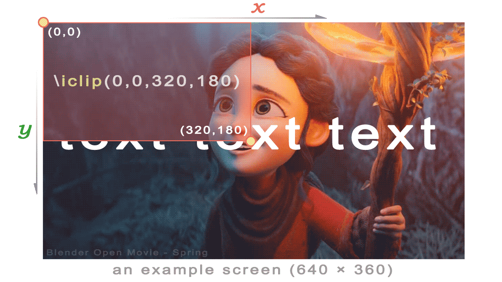

# ASSA Override Tags Reference

Advanced SubStation Alpha (ASS/SSA) override tags allow you to modify the appearance and position of subtitle text inline, overriding the default style settings.

## Overview

Override tags are enclosed in curly braces `{}` and can be placed anywhere in the subtitle text. They affect the text that follows them until another override tag changes the property or the line ends.

**Basic syntax:**
```
{\tag}text affected by tag
{\tag1\tag2}text affected by multiple tags
Normal text {\tag}tagged text{\r} back to normal
```

**Important notes:**
- Override tags must appear within override blocks: `{` and `}`
- Tags are case-sensitive
- Multiple tags can be combined in the same block
- Any unrecognized text within override blocks is silently ignored
- Tags only affect text that follows them in the subtitle line

## Quick Reference Table

| Category | Tag | Description |
|----------|-----|-------------|
| **Text Style** | `\b1` / `\b0` | Bold on/off |
| | `\i1` / `\i0` | Italic on/off |
| | `\u1` / `\u0` | Underline on/off |
| | `\s1` / `\s0` | Strikeout on/off |
| **Border/Shadow** | `\bord<size>` | Set border width |
| | `\shad<size>` | Set shadow depth |
| | `\be<strength>` | Blur edges |
| **Colors** | `\c&H<BGR>&` | Primary/text color |
| | `\3c&H<BGR>&` | Border color |
| | `\4c&H<BGR>&` | Shadow color |
| **Transparency** | `\alpha&H<AA>&` | Set alpha for all |
| | `\1a&H<AA>&` | Primary alpha |
| **Font** | `\fn<name>` | Font name |
| | `\fs<size>` | Font size |
| | `\fscx<percent>` | Horizontal scale |
| | `\fscy<percent>` | Vertical scale |
| | `\fsp<pixels>` | Letter spacing |
| **Position** | `\pos(<x>,<y>)` | Absolute position |
| | `\move(<x1>,<y1>,<x2>,<y2>)` | Move animation |
| | `\an<1-9>` | Alignment (numpad) |
| **Rotation** | `\frz<degrees>` | Z-axis rotation (2D) |
| | `\frx<degrees>` | X-axis rotation (3D) |
| | `\fry<degrees>` | Y-axis rotation (3D) |
| **Animation** | `\fad(<in>,<out>)` | Fade in/out |
| | `\t(<tags>)` | Transform/animate tags |
| | `\clip(...)` | Clipping mask |
| **Other** | `\r` | Reset to default style |
| | `\N` | Hard line break |
| | `\p<level>` | Drawing mode |

## Text Styling Tags

### Bold
- `\b1` — Enable bold
- `\b0` — Disable bold
- `\b<weight>` — Set font weight (100-900, where 400 is normal and 700 is bold)

**Example:**
```
How {\b1}are{\b0} you?          → How **are** you?
{\b1}This whole line is bold.   → **This whole line is bold.**
{\b700}Bold text{\b0}            → **Bold text**
```

### Italic
- `\i1` — Enable italic
- `\i0` — Disable italic

**Example:**
```
How {\i1}are{\i0} you?          → How *are* you?
{\i1}This whole line is italic. → *This whole line is italic.*
```

### Underline
- `\u1` — Enable underline
- `\u0` — Disable underline

**Example:**
```
How {\u1}are{\u0} you?              → How <u>are</u> you?
{\u1}This whole line is underlined. → <u>This whole line is underlined.</u>
```

### Strikeout
- `\s1` — Enable strikeout
- `\s0` — Disable strikeout

**Example:**
```
How {\s1}are{\s0} you?               → How ~~are~~ you?
{\s1}This whole line is strikeout.   → ~~This whole line is strikeout.~~
```

### Border/Outline
- `\bord<width>` — Set border/outline width in pixels (rounded/uniform)
- `\bord0` — Remove border/outline
- `\xbord<width>` — Set horizontal border width separately
- `\ybord<height>` — Set vertical border height separately

**Note:** Allows decimal values with period as decimal point (e.g., "3.5").

**Example:** `{\bord8.5}This has a large border`


**Example:** `{\xbord8.5}This has a large border width`


**Example:** `{\ybord8.5}This has a large border height`


### Shadow
- `\shad<depth>` — Set shadow depth in pixels (diagonal offset)
- `\shad0` — Remove shadow
- `\xshad<depth>` — Set horizontal shadow offset (can be negative)
- `\yshad<depth>` — Set vertical shadow offset (can be negative)

**Note:** Allows decimal values with period as decimal point (e.g., "3.5"). `\xshad` and `\yshad` can be negative for different shadow directions.

**Example:** `{\shad3}This has normal shadow`


**Example:** `{\shad8.5}This has a far away shadow`


**Example:** `{\xshad8.5}This has only xshad`


**Example:** `{\yshad8.5}This has only yshad`


### Blur
- `\blur<strength>` — Set Gaussian blur strength
- `\be<strength>` — Set blur edges strength (0-100)

**Note:** If the text has an outline (set with `\bord` or style), the outline will be blurred. If outline is not present, the text itself will be blurred.

**Example:** `{\be1}Some blurred edges works`


**Example:** `{\be8}Some blurred edges works`


**Example with outline:** `{\bord3\be8}Some blurred edges works`


## Color Tags

Colors are specified in hexadecimal **BGR** format (Blue-Green-Red, not RGB!): `&H<BB><GG><RR>&` or `&H<AA><BB><GG><RR>&` (with alpha).

**Important:** ASS/SSA uses BGR (Blue-Green-Red) order, which is different from the common RGB format!

**Color examples:**
- `&H0000FF&` — Red (not blue!)
- `&HFF0000&` — Blue (not red!)
- `&H00FF00&` — Green
- `&HFFFFFF&` — White
- `&H000000&` — Black
- `&H00FFFF&` — Yellow

### Primary Color
- `\c&H<color>&` or `\1c&H<color>&` — Set primary (text) color

**Example:**
```
This is {\c&H0000FF&}red text
This is {\1c&HFF0000&}blue text
```

### Secondary Color
- `\2c&H<color>&` — Set secondary (karaoke) color

**Note:** Used mainly for karaoke effects.

### Border Color
- `\3c&H<color>&` — Set border/outline color

**Note:** Setting the outline color has no effect if text does not have an outline (either set with `\bord` or via style).

**Example:** `{\bord3\3c&H0000FF&}This has a red outline`



### Shadow Color
- `\4c&H<color>&` — Set shadow color

**Note:** Setting the shadow color has no effect if text does not have a shadow (either set with `\shad` or via style).

**Example:** `{\shad3\4c&H0000FF&}This has a red shadow`


### Alpha/Transparency
- `\1a&H<alpha>&` — Set primary alpha (text transparency)
- `\2a&H<alpha>&` — Set secondary alpha
- `\3a&H<alpha>&` — Set border alpha
- `\4a&H<alpha>&` — Set shadow alpha
- `\alpha&H<alpha>&` — Set alpha for all components

**Important:** Alpha values range from `00` (fully opaque/visible) to `FF` (fully transparent/invisible). This is opposite to many other programs!

**Alpha value examples:**
- `&H00&` — Fully opaque (100% visible)
- `&H80&` — 50% transparent
- `&HCC&` — 80% transparent
- `&HFF&` — Fully transparent (invisible)

**Example:** `{\alpha&HCC\1a&H00}Transparent box with visible text`



**Example:** `{\an7\alpha&HCC}Watermark`


## Font Tags

### Font Name
- `\fn<font name>` — Set font name (spaces in name are allowed)
- `\fn` — Reset to style default

**Example:**
```
{\fnArial}Arial font
{\fnCourier New}Courier New font
```

### Font Size
- `\fs<size>` — Set font size in points (allows decimal values)
- `\fs` — Reset to style default

**Example:**
```
{\fs35}This is font size 35
{\fs12.5}Small text at 12.5 points
```

### Font Scale
- `\fscx<percent>` — Set horizontal font scale (100=normal, 200=double width)
- `\fscy<percent>` — Set vertical font scale (100=normal, 200=double height)

**Example:** `{\fscx200}Current size double width`


**Example:** `{\fscy200}Current size double height`


**Example:** `{\fscx200\fscy200}Current size double size`


### Font Spacing
- `\fsp<pixels>` — Set spacing between characters in pixels (can be negative for tighter spacing)

**Example:** `Normal spacing {\fsp5}5 pixel spacing`


### Font Encoding
- `\fe<encoding>` — Set font encoding (charset ID)

**Common encoding values:**
- `0` — ANSI (default)
- `1` — Default
- `128` — Shift JIS (Japanese)
- `129` — Hangul (Korean)
- `134` — GB2312 (Simplified Chinese)
- `136` — Big5 (Traditional Chinese)
- `162` — Greek
- `177` — Hebrew
- `178` — Arabic
- `222` — Thai

## Position Tags

### Position
- `\pos(<x>,<y>)` — Set absolute position (pixels from top-left)

**Important notes:**
- The `[Script Info]` section should define `PlayResX` and `PlayResY` to match your video resolution
- If `PlayResX` and `PlayResY` are not defined, a resolution of 384×288 is assumed
- Position coordinates start from top-left corner (0,0)
- The alignment tag (`\an`) determines which part of the text is anchored to the position

**Example:** `{\an2\pos(180,240)}This is \pos(180,240) with \an2`





**Example:** `{\an7\pos(180,240)}This is \pos(180,240) with \an7`



### Move
- `\move(<x1>,<y1>,<x2>,<y2>)` — Move from position 1 to position 2
- `\move(<x1>,<y1>,<x2>,<y2>,<t1>,<t2>)` — Move between times t1 and t2 (milliseconds from line start)

**Example:** `{\move(350,350,1500,350)}Move test`


**Example:** `{\move(350,350,1500,350,500,2600)}Move test`


### Alignment
- `\an<alignment>` — Set alignment (numpad style: 1=bottom-left, 2=bottom-center, 3=bottom-right, 4=middle-left, 5=center, 6=middle-right, 7=top-left, 8=top-center, 9=top-right)
- `\a<alignment>` — Legacy alignment (1=left, 2=center, 3=right, plus 5,6,7,9,10,11 for different vertical positions)

**Numpad-style alignment (`\an`) layout:**

```
7 (Top-left)      8 (Top-center)      9 (Top-right)
4 (Middle-left)   5 (Middle-center)   6 (Middle-right)
1 (Bottom-left)   2 (Bottom-center)   3 (Bottom-right)
```

**Note:** The modern `\an` tag is recommended over the legacy `\a` tag. Most subtitles use `\an2` (bottom-center) as the default.

### Margins
- `\marginl<pixels>` — Set left margin
- `\marginr<pixels>` — Set right margin
- `\marginv<pixels>` — Set vertical margin

**Note:** These tags override the margins set in the style definition. Margins define the minimum distance from the edge of the video frame.

## Rotation Tags

- `\frx<degrees>` — Rotate around X-axis (degrees)
- `\fry<degrees>` — Rotate around Y-axis (degrees)
- `\frz<degrees>` or `\fr<degrees>` — Rotate around Z-axis (degrees, counterclockwise)

**Important notes:**
- Negative values are allowed
- Values above 360 and below -360 are allowed
- Z-axis rotation is the standard 2D rotation (text spinning on screen)
- X-axis rotation creates a 3D perspective effect (top/bottom tilt)
- Y-axis rotation creates a 3D perspective effect (left/right tilt)

**Example:** `{\fr45}Test angle` (45° Z-axis rotation)


**Example:** `{\frx45}A NEW HOPE` (X-axis rotation, like Star Wars opening crawl)


**Example:** `{\fry45}Rotate Y axis`


### Rotation Origin
- `\org(<x>,<y>)` — Set the origin point used for rotation

**Note:** When there is no `\org` tag, the rotation origin is implicitly the same as the position anchor point (e.g., center-bottom of text for `\an2`). This tag is useful for rotating text around a specific point on screen.

## Text Shearing Tags

- `\fax<factor>` — Shear text horizontally (perspective distortion)
- `\fay<factor>` — Shear text vertically (perspective distortion)

**Important notes:**
- A factor of `0` means no distortion
- Usually factor will be a small number; values outside the range -2 to 2 are unlikely to have desirable results
- Shearing is performed after rotation, on the rotated coordinates
- The coordinate system used for shearing is not affected by the rotation origin

**Example:** `{\fax1}fax1 text`


**Example:** `{\fay1}fay1 text`


## Animation Tags

### Fade
- `\fad(<in>,<out>)` — Simple fade in/out (milliseconds)
- `\fade(<a1>,<a2>,<a3>,<t1>,<t2>,<t3>,<t4>)` — Complex fade with alpha values and times

**Important notes for `\fad`:**
- Adding a fade effect does not extend the duration of the line
- Uses the start and end of the line's existing display time
- Be careful that fadein + fadeout is not greater than the line duration
- Example: If a line displays for 4 seconds, fadein + fadeout should not exceed 4000 ms

**Example:** `{\fad(500,500)}Fade test` (500ms fade-in, 500ms fade-out)


**Complex fade (`\fade`) explanation:**
- Five-part fade using three alpha values and four times
- Alpha values: `a1`, `a2`, `a3` (decimal 0-255, where 0=visible, 255=invisible)
- Times: `t1`, `t2`, `t3`, `t4` (milliseconds after the start of the line)
- Before `t1`: line has alpha `a1`
- Between `t1` and `t2`: fades from `a1` to `a2`
- Between `t2` and `t3`: has alpha `a2` constantly
- Between `t3` and `t4`: fades from `a2` to `a3`
- After `t4`: has alpha `a3`

**Example:** `{\fade(0,255,0,1000,1200,1300,1500)}Fade (Advanced)`


### Transform
- `\t(<tags>)` — Animate tags over the duration of the subtitle
- `\t(<accel>,<tags>)` — Animate with acceleration (1=linear, <1=start fast/end slow, >1=start slow/end fast)
- `\t(<t1>,<t2>,<tags>)` — Animate between times t1 and t2 (milliseconds from line start)
- `\t(<t1>,<t2>,<accel>,<tags>)` — Animate between times with acceleration

**Supported tags for transformation:**
`\fs` `\fsp` `\c` `\1c` `\2c` `\3c` `\4c` `\alpha` `\1a` `\2a` `\3a` `\4a` `\fscx` `\fscy` `\frx` `\fry` `\frz` `\fr` `\fax` `\fay` `\bord` `\xbord` `\ybord` `\shad` `\xshad` `\yshad` `\clip` `\iclip` `\be` `\blur`

**Example:** `{\1c&HFFFFFF&\t(\1c&H0000FF&)}Color` (white to red transition)


**Example:** `{\1c&HFFFFFF&\t(\1c&H0000FF&\fs90)}Color` (color and size change)


### Clip
- `\clip(<x1>,<y1>,<x2>,<y2>)` — Rectangular clip (shows only inside rectangle)
- `\clip(<scale>,<drawing>)` — Vector clip using drawing commands
- `\iclip(<x1>,<y1>,<x2>,<y2>)` — Inverse rectangular clip (hides inside rectangle)
- `\iclip(<scale>,<drawing>)` — Inverse vector clip

**Note:** Clipping can be used to create split-screen effects or to hide parts of text/graphics.

**Example:** `{\clip(0,0,320,180)}text text text`



**Example:** `{\iclip(0,0,320,180)}text text text`



## Drawing Tags

- `\p<level>` — Set drawing mode (0=text, 1-4=drawing with different precision levels)
- Drawing commands use vector graphics: `m` (move), `l` (line), `b` (cubic Bézier curve), `s` (cubic B-spline), `c` (close spline), `n` (close B-spline)

**Drawing precision levels:**
- `\p0` — Text mode (normal)
- `\p1` — Drawing mode (1 pixel precision)
- `\p2` — Drawing mode (0.5 pixel precision)
- `\p3` — Drawing mode (0.25 pixel precision)
- `\p4` — Drawing mode (0.125 pixel precision)

**Drawing command syntax:**
- `m <x> <y>` — Move to position
- `l <x> <y>` — Draw line to position
- `b <x1> <y1> <x2> <y2> <x3> <y3>` — Draw cubic Bézier curve
- `s <x1> <y1> <x2> <y2> <x3> <y3> [...]` — Draw cubic B-spline
- `c` — Close spline (connect last point to first)

**Example:**
```
{\p1}m 0 0 l 100 0 100 100 0 100{\p0}
```
This draws a square.

**Note:** For complex drawings, consider using the ASSA Draw tool in Subtitle Edit.

## Other Tags

### Reset
- `\r` — Reset to default style
- `\r<style>` — Reset to specified style

**Example:** `{\c&H0000FF&\i1}Italic red text{\r} normal text`


### Line Break
- `\N` — Hard line break (always breaks, even if line wrapping is disabled)
- `\n` — Soft line break (breaks only if needed based on wrapping style)

**Note:** `\N` (uppercase) forces a line break, while `\n` (lowercase) is a "smart" break that respects the wrapping style setting.

### Karaoke
- `\k<duration>` — Standard karaoke effect (duration in 1/100 second, sweeping from left to right)
- `\K<duration>` or `\kf<duration>` — Fill karaoke (fills from left to right)
- `\ko<duration>` — Outline karaoke (outline changes color)

**Note:** Duration is in centiseconds (1/100 of a second). For example, `\k50` means 0.5 seconds.

### Wrapping Style
- `\q<style>` — Set wrapping style

**Wrapping styles:**
- `\q0` — Smart wrapping (wrap lines evenly, try to balance line lengths)
- `\q1` — End-of-line wrapping (wrap at the end of line only, as late as possible)
- `\q2` — No word wrapping (long lines extend beyond margins)
- `\q3` — Smart wrapping with lower line wider (like `\q0` but prefer more text on bottom line)

**Note:** The wrapping style determines how long lines are broken into multiple lines.

## Examples

### Basic Styling
```
{\b1}Bold text{\b0} normal text
{\i1}Italic text{\i0} normal text
{\u1}Underlined text{\u0} normal text
```

### Color Changes
```
{\c&H0000FF&}Red text{\r} normal text
{\c&HFF0000&}Blue text{\c&H00FF00&}Green text
{\1c&HFFFFFF&\3c&H0000FF&\bord2}White text with red outline
```

### Font and Size
```
{\fs50}Large{\fs} normal {\fs20}small
{\fnArial}Arial font {\fnCourier New}Courier font
{\fscx200}Wide text{\fscx100} normal
```

### Positioning
```
{\pos(640,360)}Centered on screen (for 1280×720 video with PlayResX=1280, PlayResY=720)
{\an7\pos(10,10)}Top-left corner
{\an3\pos(1270,710)}Bottom-right corner (for 1280×720)
```

### Animation
```
{\fad(500,500)}Fade in and out
{\t(\frz360)}Rotating text (360° over subtitle duration)
{\t(0,1000,\fscx200\fscy200)}Growing text in first second
{\move(100,100,1180,620)}Diagonal movement across screen
```

### Complex Combinations
```
{\b1\i1\c&HFF0000&}Bold italic blue text
{\pos(100,200)\fs40\bord3\3c&HFFFFFF&}Large text at position with thick white border
{\an5\pos(640,360)\fad(300,300)\t(\frz360)}Centered, fading, rotating text
{\clip(0,0,640,720)\move(0,360,1280,360)}Text moving behind a clip mask
```

## Advanced Topics

### Tag Priority and Order
- Tags are processed in the order they appear
- Later tags override earlier tags of the same type
- Example: `{\c&HFF0000&\c&H00FF00&}` results in green text (second color wins)

### Performance Considerations
- Complex animations and effects may impact playback performance
- Too many transform tags can cause stuttering on slower systems
- Vector clips are more expensive than rectangular clips
- High precision drawing modes (`\p3`, `\p4`) use more CPU

### Renderer Compatibility
- Some tags only work with certain renderers (VSFilter, libass, xy-VSFilter, etc.)
- Not all players support all tags
- Advanced features like `\blur`, `\xbord`, `\ybord` may not work in all players
- Always test with your target player to ensure compatibility

### Best Practices
1. Use `\r` to reset styles rather than manually reversing each tag
2. Combine multiple tags in one block for efficiency: `{\b1\i1\fs30}` rather than `{\b1}{\i1}{\fs30}`
3. Set PlayResX and PlayResY to match your video resolution for accurate positioning
4. Use decimal precision sparingly (e.g., `\fs24.5`) as not all renderers support it
5. Comment your complex override tags in separate blocks: `{Comment: This creates a spinning effect}{\t(\frz360)}`
6. Be mindful of subtitle duration when using fade effects
7. Test animations at different playback speeds

### Common Pitfalls
- **Forgetting BGR color order**: Remember colors are Blue-Green-Red, not RGB!
- **Alpha values reversed**: 00 is visible, FF is invisible (opposite of some programs)
- **Position without alignment**: `\pos` behavior depends on `\an` alignment setting
- **Transform timing**: Times in `\t` are relative to line start, not video timeline
- **Fade duration**: `\fad` fade times count against line duration, not added to it

## Notes

- Override tags are case-sensitive (`\B1` will not work, must be `\b1`)
- Some tags only work with certain renderers
- Complex animations and effects may impact playback performance
- Always test with your target player to ensure compatibility
- Unrecognized text within override blocks is silently ignored
- Mixing comments and override tags in the same block is not recommended

## See Also

- [ASSA Styles](../features/assa-styles.md) — Managing ASS/SSA styles
- [ASSA Apply Custom Override Tags](../features/assa-override-tags.md) — Applying override tags in Subtitle Edit
- [ASSA Draw](../features/assa-draw.md) — Vector drawing tool
- [ASSA Set Position](../features/assa-set-position.md) — Positioning subtitles
